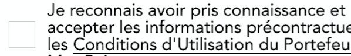

# iOS-Swift-Good-Practices

You'll find there some good practices/hints I think are very relevant and that was good for me : They can come from people I worked with, from courses/tutorials I followed, and also from others guidelines and good practices authors.

## Interesting things to know about

### Xcode UI Testing
 
#### Wait for an object to appear ( ex : animation )

    At the beginning, I encountered issues when checking if a particular button existed or not,
    simply because it was faded in ( **animation ) and so not directly present in the view.
    One interesting solution I found is this one :

     ```swift
     let enableButton = app.buttons[NSLocalizedString("Enable", comment: "foo")]
     expectationForPredicate(NSPredicate(format: "exists == true"), evaluatedWithObject: enableButton, handler: nil)
    waitForExpectationsWithTimeout(3, handler: nil)
      ```

      It'll wait for 3 seconds until the predicate is true (in our case, the button exists, so until the button appear).
      After the elapsed time, of it's not true, it'll execute the XCTAssert `exists == true`.

#### Tap at specific coordinates

   

   Clicking on the text button redirect me another view, and clicking on the square check it.
   
   What I wanted to do was just checking the button, so just tapping on the little square on the left. I did it with :

   ```swift
  let checkButtonCoordinate = app.buttons["CGUButton"].coordinateWithNormalizedOffset(CGVector(dx: 0, dy: 0))
  checkButtonCoordinate.tap()
  ```

#### Global and local variable observers
You can add variable observers in any types of variable, even __Global__ and __local__.
   
   Let's see an example :

  ```swift
  var numberOfPerson = 0 {
    didSet {
    // Do something
    }
  }

  class Person {
    var name = "Anonyme" {
      didSet {
        // Do something else
      }
    }

    func showResume() {
      var resume: String? {
        didSet {
          // Do what you need to do
        }
      }

      // ...
    }
  }
  ```

### User Defined Runtime Attribute
  You can use the from your storyboard to init some properties of your object instead of doing it programmatically.

     So, you can for example replace :
    ```swift
    self.debtView.layer.maskToBounds = true
    self.debtView.layer.cornerRadius = 5.0
    ```
    by

   


## Good practices in Swift and iOS

#### Native Swift struct initializers
Use the native Swift struct initializers rather than use CGGeometry functions.

   So replace :
   ```swift
  let myButton = UIButton(frame: CGRectMake(0.0, 0.0, self.bounds.width / 2, self.bounds.height))
  ```
  by
  ```swift
  let myButton = UIButton(frame: CGRect(x: 0.0, y: 0.0, width: self.bounds.width / 2, height: self.bounds.height))
  ```

  Because in Objective-c, we used to use CGRectMake to get a CGRect struct because for   initializing a strut, it is necessary ( as in C if my memory is good ) to create first the structure, and then assigning value to variables.
  With Swift, struct have constructors with parameters, so no need to use external functions.

#### No need to remove observer when iOS > 9.0
You don't need to remove observer in deinit function when iOS > 9.0 anymore

   From Apple Documentation
 > In OS X 10.11 and iOS 9.0 NSNotificationCenter and NSDistributedNotificationCenter will no longer send notifications to registered observers that may be deallocated[...] This means that observers are not required to un-register in their deallocation method.

#### Range operator
To check if a number is between a range, **don't do**
 ```swift
if number >=0 && number <= 100
```
 Use range and news operators **instead** :
 ```swift
 if 0...100 ~= number
 ```

#### Extensions
Use **extension** when conforming to some protocol ( uitableview, printable, .. ) to keep a well organized code unless if that's its role.

  ```swift
  // MARK: - TableView Delegate -

  extension HomeViewController: UITableViewDataSource {

    func tableView(tableView: UITableView, numberOfRowsInSection section: Int) -> Int {
      return 5
    }

    func numberOfSectionsInTableView(tableView: UITableView) -> Int {
      return 1
    }

    // etc.
  }
  ```  

#### Tips for using let
Use **let** until Xcode yell so you can replace it with **var**

#### Typealias for a argument/return type
Use typealias when closures are referenced in multiple places
  ```swift
  typealias CoolClosure = (foo: Int) -> Bool
  ```

#### CGRect and negative values
When accessing the x, y, width, or height of a CGRect, prefer using rect.width, rect.minY, etc.. that are swift extension and that by default standardize values instead of direct struct member access.
From Apple's CGGeometry reference:
>All functions described in this reference that take CGRect data structures as inputs implicitly standardize those rectangles before calculating their results. For this reason, your applications should avoid directly reading and writing the data stored in the CGRect data structure. Instead, use the functions described here to manipulate rectangles and to retrieve their characteristics.

  For example :

  ```swift
    let rect = CGRect(origin: CGPoint(x: 0.0, y: 0.0), size: CGSize(width: -40.0, height: -40.0))

    rect.size.width // return -40,  Not good, negative value
    rect.width      // return 40,  OK

    rect.origin.y   // return 0.0,  Not OK
    rect.minY       // return -40.0,  OK
  ```

## Good practices and hint in iOS Project in general

- Stanford hint : *In fact, in general, any method that has more than a dozen lines of code is probably going to be hard for readers of your code to understand (and might well betray a “less than optimal” architectural approach).*  So a possible solution will be to add sub-functions inside the main function. Don't abuse of that if you have 5 lines in your code .. :]

- Use **pragma mark** to organize your code
   ```swift
// MARK: - UITableViewDataSource Delegate -
```

- You can consider making **TODO/FIXME as warning**, sometimes that helps !

- Having a clear application architecuture is good, having a clear/reusable code is awesome. So you better be documented about **design patterns** :
  -  http://www.raywenderlich.com/46988/ios-design-patterns
  -  http://www.raywenderlich.com/86053/intermediate-design-patterns-in-swift
  -  https://github.com/ochococo/Design-Patterns-In-Swift
