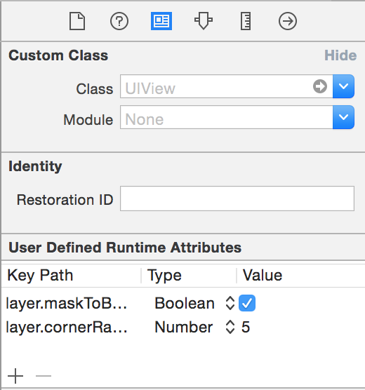

# iOS-Swift-Good-Practices

You'll find there some good practices/hints I think are very relevant and that was good for me : They can come from people I worked with, from courses/tutorials I followed, and also from others guidelines and good practices authors.

You can also visit my personal swift code snippets [there](https://github.com/Aymenworks/Swift-Personal-Snippets).
## Good practices in Swift and iOS

- Use the more possible the **User Defined Runtime Attribute** from your storyboard to init some properties of your object instead of doing it programmatically.
You can for example replace :
```swift
self.debtView.layer.maskToBounds = true
self.debtView.layer.cornerRadius = 5.0
```
by



- Use the native Swift struct initializers rather than use CGGeometry functions.

So replace
```swift
let myButton = UIButton(frame: CGRectMake(0.0, 0.0, self.bounds.size.width / 2, self.bounds.size.height))
```
by
```swift
let myButton = UIButton(frame: CGRect(x: 0.0, y: 0.0, width: CGRectGetWidth(self.bounds) / 2, height: CGRectGetHeight(self.bounds)))
```

Because in Objective-c, we used to use CGRectMake to get a CGRect struct because for   initializing a strut, it is necessary ( as in C if my memory is good ) to create first the structure, and then assigning value to variables.
With Swift, struct have constructors with parameters, so no need to use external functions.

- Use **pragma mark** to organise your code
```swift
// MARK: - UITableViewDataSource Delegate -
```

- Use **extension** when conforming to some protocol ( uitableview, printable, .. ) to keep a well organized code unless if that's its role.

```swift
// MARK: - TableView Delegate -

extension HomeViewController: UITableViewDataSource {

  func tableView(tableView: UITableView, numberOfRowsInSection section: Int) -> Int {
    return 5
  }

  func numberOfSectionsInTableView(tableView: UITableView) -> Int {
    return 1
  }

  // etc.
}
```  

- Use **let** until Xcode yell so you can replace it with **var**

- To check if a number is between a range, **don't do**
 ```swift
if number >=0 && number <= 100
```
 **Use** range and news operators **instead** :
 ```swift
 if 0...100 ~= number
 ```

- Don't do things that need frame/bounds coordinate in the viewDidLoad, because that's officialy setted on the viewWillAppear and if you try to do it before, you'll receive some informations, yes, but maybe not the last and the most relevant, because it can change after the viewDidLoad ,for example when its checking if the iPhone in on the Portrait or Landscape, if there is navigation bar, and things like that. So **don't make code that is geometry-dependent here.**

- If you need the frame coordinate system, **use** ```swift self.bounds ```, **not** ```self.frame```, because bounds use its own coordinate system while self.frame use the super view coordinate system.

- If you play with graphics, use **CGFloat** instead of **Float/Double**

- Stanford hint : *In fact, in general, any method that has more than a dozen lines of code is probably going to be hard for readers of your code to understand (and might well betray a “less than optimal” architectural approach).*  So a possible solution will be to add sub-functions inside the main function. Don't abuse of that if you have 5 lines in your code .. :]

- Don't forget to use the ```didSet/willSet``` observers appeared with swift, they can be very useful ( for IBOutlet too )

- UITableView :
  - Even if there are 10000 rows, only the visible rows are UITableViewCell, so that means that those rows will be reusable for the following rows.
  - Use
  ```swift
func dequeueReusableCellWithIdentifier(identifier: String, forIndexPath indexPath: NSIndexPath) -> AnyObject
```
  It takes care to reuse the row or making a copy of one of your   prototypes    from your storyboard ( so you need to have a reuseIdentifier for your prototype, because you can have not only one    row prototype )
  - Be aware si you do network works with the cells : When the cell appear, you want to fetch data by downloading an image or data, if you scroll and get back again, and the http request just finished, you'll set the data on a cell different than the cell because the cell are reusable, so when scrolling it will reuse the cell to display others rows informations
- Where can you store your reuse identifier for your cells ?
 ```swift
  private struct Storyboard {
    static let cellReuseIdenifier = "PersonCell"
  }
  ```

- Use typealias when closures are referenced in multiple places
  ```swift
  typealias CoolClosure = (foo: Int) -> Bool
  ```

- When clearing out your UILabel, put a " " (space) in there, not nil or "" (empty string), otherwise your UILabel will shrink down vertically, shifting your UI around.

- When accessing the x, y, width, or height of a CGRect, always use the CGGeometryfunctions instead of direct struct member access.
From Apple's CGGeometry reference:
>All functions described in this reference that take CGRect data structures as inputs implicitly standardize those rectangles before calculating their results. For this reason, your applications should avoid directly reading and writing the data stored in the CGRect data structure. Instead, use the functions described here to manipulate rectangles and to retrieve their characteristics.


## Good practices and hint in iOS Project in general

- You can create **snippet** to void you to write some redendant function like the methods from the UITableViewDataSource for example

- Don't forget to use a versionning system ( git/github, svn, .. )

- Don't forget to write good commits, examples (IMP : improvment) :
  - [ADD] UIAccessibility on the Walkthrough view to have a better user experience for blind people
  - [IMP] I replaced the customSort(..) function because the native sort(..) function already had this functionanlity
  - [FIX] Fixed the wording problem about the wrong title view that have been signaled on the #2193 ticket number

- You can generate some good html documentations using [jazzy](https://github.com/realm/jazzy)

- You can create on your finder the same architecture that appears on your Xcode project using [synx](https://github.com/venmo/synx)

- You can consider making **TODO/FIXME as warning**, sometimes that helps !

- Having a clear application architecuture is good, having a clear/reusable code is awesome. So you better be documented about **design patterns** :
  -  http://www.raywenderlich.com/46988/ios-design-patterns
  -  http://www.raywenderlich.com/86053/intermediate-design-patterns-in-swift
  -  https://github.com/ochococo/Design-Patterns-In-Swift
